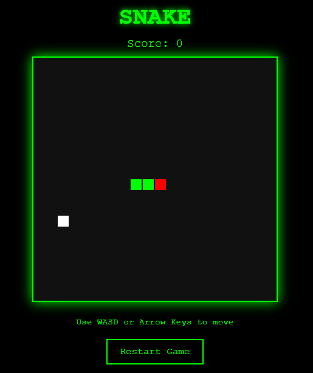

# Retro Snake Game



A classic Snake game implementation using HTML5 Canvas and JavaScript with a retro green-on-black aesthetic.

## Installation & Usage

1. Clone or download the project files
2. Open `index.html` in a web browser
3. Use keyboard controls to play
4. Open `tests/test.html` to run unit tests

## Project Structure

```
retro-snake-game/
├── index.html              # Main game interface
├── scripts/
│   └── script.js          # Game logic and rendering
├── styles/
│   └── style.css          # Retro styling
├── tests/
│   ├── test.html          # Core game logic tests
│   ├── responsive-test.html # Screen size tests
│   └── touch-controls-test.html # Touch control tests
├── images/
│   └── retro-snake-game.svg # Game screenshot
├── README.md               # This documentation
└── API.md                  # API documentation
```

## Features

- Classic Snake gameplay mechanics
- Retro terminal-style visual design
- Progressive speed increase every 50 points
- Collision detection (walls and self)
- Smart food placement (avoids snake body)
- Keyboard controls (WASD + Arrow keys)
- Score tracking
- Game restart functionality

## Technical Architecture

### Core Components

#### Game State Variables
- `snake`: Array of coordinate objects representing snake segments
- `food`: Object with x,y coordinates for food position
- `dx, dy`: Movement direction vectors
- `score`: Current player score
- `gameSpeed`: Current game loop interval (decreases for speed increase)
- `gameInterval`: Reference to setInterval for game loop control

#### Pure Functions (Testable)
- `generateFoodPosition(snake, tileCount)`: Creates food position avoiding snake
- `calculateNewHead(currentHead, dx, dy)`: Computes next head position
- `isGameOver(head, snake, tileCount)`: Collision detection logic
- `checkFoodCollision(head, food)`: Food consumption detection
- `calculateNewSpeed(score, currentSpeed)`: Speed progression logic

#### Game Loop Functions
- `moveSnake()`: Updates snake position and handles collisions
- `drawGame()`: Renders game state to canvas
- `gameLoop()`: Main game tick (calls move and draw)
- `resetGame()`: Resets all game state to initial values

### Game Mechanics

#### Movement System
- Grid-based movement (20px tiles on 400x400 canvas)
- Direction changes via keyboard input
- Prevents reverse direction to avoid instant death

#### Collision Detection
- **Wall Collision**: Head position outside canvas bounds
- **Self Collision**: Head position matches any body segment
- **Food Collision**: Head position matches food position

#### Scoring System
- +10 points per food consumed
- Speed increases every 50 points (interval decreases by 20ms)
- Minimum speed cap at 50ms interval

#### Visual Design
- **Snake Head**: Red (#f00)
- **Snake Body**: Green (#0f0)
- **Food**: White (#fff)
- **Background**: Dark gray (#111)
- **UI**: Bright green (#0f0) with glow effects

## Controls

| Key | Action |
|-----|--------|
| W / ↑ | Move Up |
| S / ↓ | Move Down |
| A / ← | Move Left |
| D / → | Move Right |
| Restart Button | Reset Game |


## Browser Compatibility

- Modern browsers with HTML5 Canvas support
- Chrome, Firefox, Safari, Edge (latest versions)
- No external dependencies required

## Testing

Unit tests are available in `test.html` covering:
- Movement calculations
- Collision detection
- Food placement logic
- Speed progression
- Game state validation

## Performance Considerations

- Canvas rendering optimized for 60fps
- Minimal DOM manipulation
- Efficient collision detection algorithms
- Memory-conscious array operations

## Future Enhancements

- High score persistence
- Multiple difficulty levels
- Power-ups and special foods
- Sound effects
- Mobile touch controls
- Multiplayer support